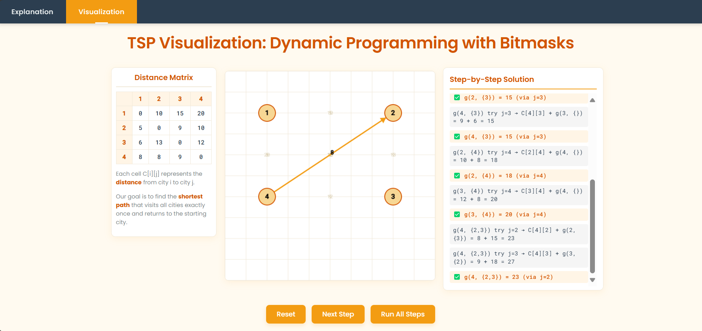

🚀 Algorithm Visualizer
An interactive, web-based visualization tool to help users understand and explore algorithms through dynamic graphics, explanations, and guided steps.

📁 Project Structure
index.html – Main HTML page with UI layout and content.

style.css – Custom-designed CSS for a modern, clean UI using basic CSS (no frameworks).

script.js – JavaScript logic for handling visualization and interactivity.

🎯 Features
🔍 Interactive Algorithm Visualization

🧠 Step-by-Step Explanation and Log Output

🖌️ Custom UI with CSS Grid Layout

📱 Responsive Design for Different Devices

🛠️ Technologies Used
HTML

CSS (Custom, no frameworks)

JavaScript (Vanilla)

📸 Screenshots

🧪 How to Use
Clone the repository:
git clone https://github.com/kritika-d5/Travelling-Salesman-Simulation.git

Open the index.html file in any web browser.
